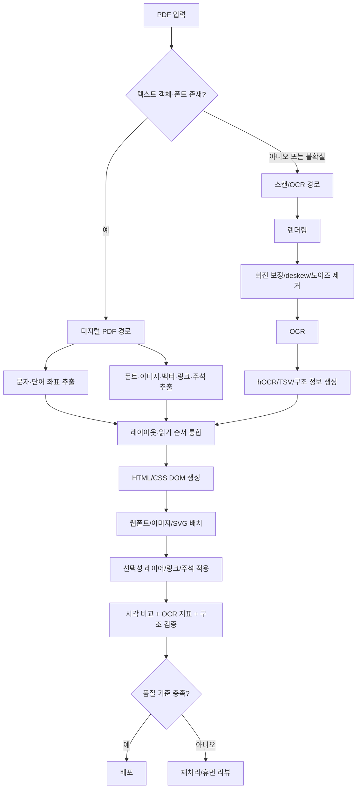

# PDF를 스캔 수준으로 복제하는 HTML 출력 코드 생성 분석 보고서

## Executive summary

결론부터 말하면, **가능하다**. 다만 “PDF를 HTML로 바꾼다”기보다 **페이지 단위 고정 레이아웃을 HTML/CSS/SVG로 재현한다**고 보는 것이 정확하며, 실무적으로는 **배경 SVG/PNG + 좌표 기반 텍스트 레이어 + 선택적 주석/링크 레이어**를 겹치는 하이브리드 방식이 가장 안정적이다. PDF 파서들은 문자 좌표·폰트·이미지·벡터를 추출할 수 있고, OCR 엔진들은 hOCR·TSV·검색 가능한 텍스트 레이어를 만들 수 있으며, 직접 변환기와 브라우저 뷰어도 같은 층(layer) 개념을 사용한다. citeturn0search1turn8search12turn9search8turn11search3turn3search4

정확도의 상한은 **입력 PDF가 디지털 PDF인지, 스캔본인지**에 크게 좌우된다. 디지털 PDF는 텍스트 객체와 폰트 정보가 남아 있어 높은 시각 재현이 가능하지만, 스캔본은 OCR 정확도와 전처리 품질에 지배되며, 저해상도·기울기·배경무늬·압축 손상에서 한계가 빨리 드러난다. 업로드된 예시만 봐도 파싱 가능한 PDF와 이미지형 PDF가 함께 존재하므로, **입력 판별 후 파이프라인을 분기**하는 설계가 필수다. citeturn11search5turn6search0turn6search2 fileciteturn0file0 fileciteturn0file1 fileciteturn0file2 fileciteturn0file3

프로젝트 난이도를 가장 크게 바꾸는 결정은 세 가지다. **텍스트 선택/복사 가능 여부**, **접근성 요구 수준**, **폰트 임베딩 허용 여부**다. 이 셋이 미정이면 구현 범위도 확정되지 않는다. 텍스트 선택성과 접근성이 필요할수록 단순 이미지 복제는 부족하고, 폰트 라이선스가 막히면 웹폰트 임베딩 대신 대체 폰트나 SVG path 같은 차선책을 써야 한다. citeturn11search4turn3search1turn18search7turn7search11turn7search10turn0search14

## 목표 정의

이 요청을 실무 요구사항으로 재정의하면 아래와 같다.

| 항목 | 정의 |
|---|---|
| 입력 | 다양한 유형의 PDF |
| 스캔본/디지털 PDF 구분 | **미지정** |
| 입력 언어 | **미지정** |
| 입력 품질 | **미지정** |
| 출력 | 시각적으로 동일한 HTML |
| 텍스트 선택/복사 가능 여부 | **미지정** |
| 검색 가능 여부 | **미지정** |
| 하이퍼링크·주석 보존 여부 | **미지정** |
| 접근성 요구 | **미지정** |
| 반응형 레이아웃 필요 여부 | **미지정** |
| 폰트 원본 재사용 허용 여부 | **미지정** |
| 배포 방식 | **미지정** |
| 성능 목표 | **미지정** |
| 비용 한도 | **미지정** |

이 표현에서 가장 중요한 해석 포인트는 **“스캔 수준으로 복제”가 무엇을 뜻하는가**이다. 실무에서는 보통 다음 세 가지 모드로 갈린다.

| 출력 모드 | 시각 재현 | 텍스트 선택/검색 | 접근성 | 난이도 | 비고 |
|---|---|---|---|---|---|
| 페이지 이미지 중심 HTML | 매우 높음 | 거의 없음 | 매우 낮음 | 낮음 | 가장 쉽지만 “HTML화” 효용이 적음 |
| 검색 가능한 스캔형 HTML | 높음 | 가능 | 낮음~중간 | 중간 | 배경 이미지 위에 hidden/transparent text layer |
| 가시 텍스트 중심 HTML | 중간~높음 | 높음 | 중간~높음 | 높음 | absolute positioning·웹폰트·의미 태깅 필요 |

Tesseract는 hOCR·TSV·검색 가능한 PDF 텍스트 레이어를 만들 수 있고, OCRmyPDF는 스캔 PDF에 텍스트 레이어를 추가하며, PDF.js 계열은 text layer와 annotation layer를 분리해 선택·검색·주석을 처리한다. 따라서 **가장 현실적인 기본 가정**은 “페이지 단위 고정 레이아웃 HTML을 만들되, 텍스트 선택성은 옵션으로 두는 것”이다. citeturn11search4turn11search3turn11search5turn3search4

이 보고서에서는 다음을 **명시적 가정**으로 둔다.

| 가정 | 내용 |
|---|---|
| 기본 가정 | 반응형 리플로우보다 **시각 재현**이 우선 |
| 출력 단위 | 페이지 단위 고정 레이아웃 |
| 추천 경로 | 디지털 PDF는 파서 기반, 스캔 PDF는 OCR 기반으로 분기 |
| 권장 성공 기준 | 픽셀 유사도 + 텍스트 추출 정확도 + 구조 보존율의 조합 |

## 기술 스택 및 도구 비교

단일 도구 하나로 끝내기보다는, **파싱/렌더링 + OCR + 레이아웃 분석 + HTML/CSS 생성 + 폰트/이미지 처리 + 검증**의 조합형 스택이 현실적이다. 특히 최종 목표가 “브라우저에서 PDF처럼 보이는 HTML”이라면, 대부분의 상용·오픈소스 도구는 **최종 HTML clone 자체**보다 **중간 표현(좌표, 블록, 텍스트, 테이블, 이미지, 링크)**을 잘 제공하는 쪽에 가깝다. citeturn9search9turn13search4turn1search3turn2search5turn8search12turn3search4

### 오픈소스 중심 도구 비교

| 도구 | 역할 | 장점 | 한계 | 추천 사용 사례 | 근거 |
|---|---|---|---|---|---|
| MuPDF / PyMuPDF | PDF 파싱, 렌더링, text/html/json/svg 출력 | 빠르고 저수준 정보가 풍부하며, HTML·SVG·구조화 텍스트 출력 경로가 있다 | 브라우저용 최종 HTML을 그대로 쓰기엔 후처리가 필요하고, 텍스트 정확도와 외형 정확도 사이의 트레이드오프가 있다 | 커스텀 HTML 생성기, 벡터 많은 문서, Python 기반 파이프라인 | citeturn8search12turn14search14turn0search14 |
| PDFBox | 텍스트 좌표·폰트 추출, 이미지 추출, PDF→이미지 렌더링 | Java 생태계에 잘 맞고 TextPosition, PDFRenderer, ExtractImages 등 기본기가 탄탄하다 | HTML 재구성은 직접 구현해야 하며 브라우저 폰트 매칭은 별도 문제다 | Java 서버, 문서 파서 백엔드, 디지털 PDF 위주 | citeturn0search1turn14search1turn14search0turn9search1 |
| Poppler | 렌더링 및 CLI 유틸리티(pdftotext, pdftohtml, pdftocairo) | 성숙한 유틸리티 묶음으로 SVG/PNG/HTML/text 추출이 쉽다 | 출력 HTML이 의미론적이라기보다 변환 결과물에 가깝고 후정리가 필요하다 | CLI 배치 처리, 프로토타이핑, SVG/이미지 export | citeturn9search6turn9search8turn14search3 |
| pdf2htmlEX | PDF→HTML 직접 변환 | **정확한 폰트/위치의 native HTML text**, links, outlines, SVG background 지원 | 대개 absolute-positioned publishing HTML이라 유지보수성과 의미 HTML 품질은 낮다 | “PDF처럼 보이는 HTML” 시제품, 정적 발행 | citeturn3search3turn12search2 |
| Tesseract | OCR, hOCR, TSV, searchable PDF | 오픈소스, 한국어 traineddata 제공, hOCR 좌표 출력 가능 | 저품질 스캔, 복잡한 표·도장·하이라이트·배경무늬에 약하다 | 온프레미스 OCR, 검색 가능한 text layer, 비용 최소화 | citeturn11search4turn11search3turn4search8turn15search5 |
| OCRmyPDF | 스캔 PDF 전처리와 OCR text layer 부여 | 스캔·디지털 혼합 PDF에 강하고, rotate/background/deskew/clean과 멀티코어 처리가 가능하다 | 최종 산출물은 기본적으로 searchable PDF이며 HTML은 별도 생성해야 한다 | 스캔본 정규화, OCR 전처리, 보조 파이프라인 | citeturn11search5turn6search2turn15search2 |
| PaddleOCR / PP-Structure | OCR + 레이아웃 분석 + 표 인식 + 읽기 순서 복원 | 다국어, 한국어 지원, 문서 전처리·표·레이아웃 처리 기능이 넓다 | GPU/모델 운영 부담이 있고 엔드투엔드 결과를 그대로 배포용 HTML로 쓰기엔 추가 후처리가 필요하다 | 한국어 문서 OCR, 복잡한 표/다단 문서, 자체 호스팅 | citeturn1search0turn1search8turn4search5turn15search0turn15search12 |
| Layout Parser | 문서 레이아웃 검출 | 복잡한 문서 구조 검출을 간결하게 붙일 수 있다 | OCR, 테이블 구조화, HTML 생성은 별도 구성 요소가 필요하다 | 문서 유형이 다양하고 레이아웃 검출을 맞춤화해야 할 때 | citeturn1search1turn1search5 |
| fonttools + WOFF2 | 폰트 서브셋 생성, 웹폰트 경량화 | 필요한 글리프만 묶어 payload를 줄이기 좋고 웹 배포에 적합하다 | 라이선스와 glyph 누락 관리가 중요하다 | 웹폰트 임베딩, PDF 폰트 대체·서브셋팅 | citeturn2search3turn3search2 |
| PDF.js 레이어 모델 | 브라우저 렌더링 구조 참고 모델 | canvas/text/annotation/metadata 레이어 분리가 실전적으로 검증돼 있다 | 뷰어 구조이지 “정적 HTML 코드 생성기”는 아니다 | 선택·검색·주석 레이어 설계 참고, 웹 뷰어 통합 | citeturn3search4turn12search17 |

### 상용 및 클라우드 도구 비교

| 도구 | 역할 | 장점 | 한계 | 추천 사용 사례 | 근거 |
|---|---|---|---|---|---|
| Cloud Vision API | 문서 OCR, handwriting 포함 dense text 인식 | 구조 계층(fullTextAnnotation)과 PDF/TIFF 비동기 OCR이 가능하고 한국어 지원 문서가 있다 | 문서 레이아웃/표 복원은 전용 문서 AI보다 얕다 | 단순 OCR, 빠른 PoC, 이미지·PDF 혼합 OCR | citeturn1search6turn13search4turn10search4turn8search0 |
| Document AI Enterprise Document OCR | 문서용 OCR, embedded text 추출, 회전 수정 | PDF·이미지에서 block/paragraph/line/word/symbol 검출, 디지털 PDF embedded text 추출 지원 | 비용과 quota 관리가 필요하고 최종 HTML은 별도 생성해야 한다 | 대량 문서 OCR, 디지털+스캔 혼합 문서, 구조 인식 강화 | citeturn8search5turn10search1turn10search9turn5search8 |
| Document Intelligence | OCR, layout, tables, custom extraction, confidence | 다국어 문서 처리와 레이아웃/표/필드 추출이 강하고 confidence 해석 문서가 있다 | 서비스 한도와 과금 관리가 필요하며 최종 HTML clone은 커스텀 구현 영역이다 | 기업 문서 추출, OCR + 구조화 + 커스텀 모델 | citeturn1search3turn1search7turn4search3turn13search1turn15search3 |
| Textract | 텍스트, forms, tables, signatures, queries | tables/forms 표현이 좋고 confidence 기반 후처리가 쉽다 | 공식 best practices 상 현재 지원 언어가 영어·스페인어·독일어·이탈리아어·프랑스어·포르투갈어 중심이어서 **한국어 문서에는 우선순위가 낮다** | 영문 양식·표 문서, 클라우드 문서 인식 | citeturn17search3turn2search16turn13search2turn17search2turn5search6 |
| PDF Extract API | native/scanned PDF에서 구조·텍스트·표·이미지 추출 | 문단/제목/목록/table/figure와 읽기 순서, 스타일, 레이아웃 정보를 구조 JSON으로 준다 | 페이지·파일 크기·요청률 제한이 있고, HTML clone은 여전히 후처리기 필요 | 구조가 복잡한 PDF의 재게시, 콘텐츠 재활용 | citeturn9search9turn2search2turn10search6turn5search7 |
| PDF Accessibility Auto-Tag API | 태깅과 읽기 순서 보조 | 표·문단·목록·제목 태깅과 읽기 순서 식별에 도움을 준다 | HTML 생성기가 아니라 접근성 보조 도구이며, 벡터 아트 등은 품질이 낮을 수 있다 | 접근성 요구가 높은 파이프라인의 보조 단계 | citeturn18search0turn18search16turn18search10turn18search8 |

한국어 문서, 스캔 혼재, 시각 재현 중심이라는 조건을 놓고 보면, **오픈소스 기본선**은 `MuPDF/PyMuPDF + PaddleOCR(또는 Tesseract) + OCRmyPDF + fonttools` 조합이고, **빠른 상용 도입선**은 `Document AI` 또는 `Document Intelligence` 또는 `PDF Extract API`로 구조 정보를 받은 뒤 **별도 HTML 생성기**를 얹는 구조가 가장 현실적이다. 한국어가 핵심이라면 공식 best practices 기준상 Textract는 우선순위를 낮추는 편이 안전하다. citeturn8search5turn1search3turn9search9turn17search2

## 처리 파이프라인 설계

권장 파이프라인은 **입력 판별 → 분기 처리 → 공통 HTML 합성 → 검증** 구조다. 핵심은 모든 페이지를 일괄 OCR하지 말고, 먼저 텍스트 객체와 폰트/벡터 존재 여부를 확인해 **born-digital 경로와 scan/OCR 경로를 나누는 것**이다. 스캔형은 회전 보정·deskew·배경 제거 같은 전처리가 OCR 품질을 크게 좌우하고, 디지털 PDF는 텍스트 좌표와 폰트 정보를 보존하는 것이 더 중요하다. citeturn6search0turn6search2turn11search5turn8search5

### 단계별 설계와 기술 이슈

| 단계 | 핵심 작업 | 기술적 이슈 | 권장 구현 |
|---|---|---|---|
| 입력 전처리 | 암호/손상 검사, 페이지 분리, 텍스트층 존재 여부 판별 | 이미지형 PDF는 DPI와 기울기·배경무늬가 OCR 성능을 좌우한다 | 디지털 PDF는 텍스트 추출 우선, 스캔형은 300dpi 안팎 렌더링·deskew·clean 적용 | citeturn6search0turn6search2turn14search1 |
| OCR/텍스트 추출 | 디지털 PDF는 text positions 추출, 스캔형은 OCR·hOCR·TSV 추출 | OCR만으로는 링크·주석·메타데이터가 복구되지 않으며 reading order가 흔들릴 수 있다 | 디지털은 PDF 파서, 스캔은 OCR 결과를 사용하되 공통 좌표 모델로 정규화 | citeturn0search1turn11search3turn13search16 |
| 레이아웃 분석 | 문단/표/그림/제목/다단/주석 검출, 읽기 순서 정렬 | 표 셀 병합, 다단 레이아웃, 캡션/각주, 겹침 객체가 어렵다 | 룰 기반 + 학습 기반 혼합; 표는 별도 모듈로 분리 | citeturn1search0turn1search8turn9search9 |
| HTML/CSS 생성 | 페이지 wrapper, absolute-positioned span/div, SVG 배경, z-index | 브라우저 폰트 메트릭과 PDF 메트릭 차이로 줄바꿈·자간이 어긋날 수 있다 | 기본은 fixed page container, 텍스트는 absolute positioning, 벡터는 SVG 우선 | citeturn3search3turn3search4turn8search12turn0search14 |
| 폰트·이미지 처리 | 웹폰트 서브셋, PNG/JPEG 추출, SVG 변환 | 폰트 라이선스와 glyph 누락, 색상/투명도/안티앨리어싱 차이 | @font-face + WOFF2 서브셋을 우선, 불가 시 metric-compatible fallback 또는 path/SVG 사용 | citeturn2search3turn3search2turn14search3turn8search8 |
| 후처리/검증 | 링크/주석 매핑, confidence 검사, visual diff, 휴먼 리뷰 | 외형이 맞아도 선택 박스·읽기 순서·표 구조가 틀릴 수 있다 | OCR confidence와 CER/WER, 페이지 렌더 diff, 링크/표 회귀 테스트를 함께 사용 | citeturn13search1turn13search2turn13search3turn3search4 |

실제 HTML 생성 단계에서는 **DOM을 문서 전체가 아니라 페이지별로 끊는 것**이 중요하다. 페이지 컨테이너를 PDF 페이지 크기와 동일한 기준 좌표계로 두고, 텍스트는 `span/div` 절대 배치, 벡터는 SVG, 래스터는 `img`, 링크·주석은 별도 overlay로 처리하면 관리가 쉬워진다. 이 구조는 PDF.js의 canvas/text/annotation layer 개념과 유사하며, pdf2htmlEX도 정밀 위치의 native HTML text와 SVG background를 활용한다. citeturn3search4turn3search3turn12search2

가장 실용적인 출력 전략은 두 가지다. **시각 재현이 최우선**이면 `배경 SVG/PNG + selectable/invisible text layer`가 유리하고, **텍스트 활용성이 최우선**이면 `visible text + 폰트 서브셋 + 부분 SVG`가 유리하다. 전자는 스캔복제에 가깝고, 후자는 HTML다운 결과물에 가깝다. 둘을 혼합한 하이브리드가 보통 최적점이다. citeturn11search3turn11search5turn0search14turn2search3

## 재현 정확도와 한계

핵심 원칙은 간단하다. **“픽셀 수준의 동일성”과 “완전한 텍스트 선택성/의미론/접근성”은 동시에 100% 달성하기 어렵다.** MuPDF도 SVG 출력에서 `text=text`는 폰트 정확도가 떨어질 수 있고, `text=path`는 외형은 더 정확하지만 일반적으로 텍스트 활용성이 낮아진다는 점을 명시적으로 드러낸다. 또한 데이터 테이블은 본래 데이터 구조로 마크업하는 것이 권장되며, layout용 table은 접근성을 해친다. citeturn0search14turn3search1turn18search7

| 측면 | 가능한 수준 | 대표 한계 | 실무 권장안 | 근거 |
|---|---|---|---|---|
| 레이아웃 재현 | 단일 컬럼·단순 폼은 높음, 다단·복합 표·각주·겹침 객체는 중간 | 읽기 순서와 시각 배치가 충돌할 수 있다 | 표/다단은 별도 검출 후 고신뢰만 semantic 재구성, 나머지는 배경+overlay | citeturn1search0turn1search8turn9search9 |
| 폰트·자간·행간 | 임베딩 폰트가 가능하면 높음 | 브라우저 렌더링, 폰트 대체, kerning 차이로 drift 발생 | 웹폰트 서브셋 우선, 불가 시 metric fallback; 극단 케이스는 SVG path | citeturn2search3turn3search2turn0search14 |
| 이미지·벡터 그래픽 | 일반 이미지와 단순 도형은 높음 | 복잡한 벡터, CAD류, 투명도/클리핑/특수 브러시는 HTML DOM 분해가 어렵다 | 벡터는 SVG 유지, 안 되면 페이지 배경에 포함 | citeturn14search3turn8search8turn12search16turn18search10 |
| 하이퍼링크·주석·메타데이터 | 디지털 PDF라면 중간~높음 | OCR-only 경로에선 원본 링크/주석 의미가 사라진다 | 디지털 PDF는 annotation/link layer 복사, 스캔형은 별도 재정의 | citeturn12search2turn3search4turn12search4 |
| 텍스트 선택성·검색·복사 | hidden/visible text layer로 가능 | OCR 오차, 폰트 메트릭 차이, path화 시 활용성 저하 | 검색/복사가 필요하면 path 남용 금지, hOCR/TSV 좌표 보정 필수 | citeturn11search3turn11search5turn3search4turn0search14 |
| 접근성 | 의미 태깅을 추가하면 중간까지 가능 | 시각 복제용 absolute span만으로는 스크린리더 친화적이지 않다 | heading/list/table/article/nav 등 재의미화와 ARIA 보강 필요 | citeturn3search1turn18search7turn18search17turn18search0 |

따라서 **디지털 PDF의 최고치**는 “매우 높은 시각 유사도 + 중간 이상 텍스트 활용성”이고, **스캔형 PDF의 최고치**는 “높은 시각 유사도 + OCR 품질에 의존하는 선택성” 정도로 보는 것이 현실적이다. 특히 복잡한 표, 다단 학술 문서, 도장/서명/보안무늬가 섞인 증명서류, 하이라이트/밑줄/주석이 많은 문서는 1회 자동 변환만으로 완성도를 보장하기 어렵다. citeturn1search0turn2search16turn18search0turn6search0

## 성능·자동화·스케일링 고려사항

성능은 크게 **파서 중심 경로**와 **OCR 중심 경로**로 갈린다. 디지털 PDF는 텍스트와 객체를 추출하므로 대체로 CPU 파싱 비용이 지배적이지만, 스캔형은 렌더링·전처리·OCR·레이아웃 분석이 병렬 비용을 대부분 먹는다. 따라서 처리시간을 줄이는 가장 좋은 방법은 GPU를 무작정 넣는 것이 아니라, **먼저 OCR이 필요한 페이지를 줄이는 것**이다. citeturn11search5turn6search2turn8search5

| 주제 | 실무 판단 | 근거 |
|---|---|---|
| 처리 속도 | 전체 문서 OCR보다 **텍스트층 존재 여부를 먼저 판정**해 OCR 페이지를 줄이는 것이 가장 큰 최적화다 | citeturn11search5turn8search5 |
| 병렬화 | 페이지 단위 병렬화가 가장 단순하고 효과적이며, OCRmyPDF는 멀티코어를 기본 활용한다 | citeturn15search2turn10search19 |
| GPU 사용 | 딥러닝 OCR/레이아웃(PaddleOCR 계열)은 GPU 이득이 크지만, Tesseract는 LSTM 엔진에서 OpenCL 성능 향상이 없다고 문서화돼 있다 | citeturn15search0turn15search12turn15search9 |
| 메모리 사용 | 대형 PDF·고해상도 렌더링·멀티페이지 배치는 메모리를 급격히 올린다 | citeturn10search9turn10search6 |
| 클라우드 자동화 | 대량 처리는 비동기 배치와 quota 관리가 필수다 | citeturn10search4turn10search1turn15search3turn17search10 |

### 비용과 운영 모델

| 운영 모델 | 비용 구조 | 장점 | 주의점 | 근거 |
|---|---|---|---|---|
| 오픈소스 자체 호스팅 | 라이선스 비용은 낮지만 CPU/GPU·스토리지·운영 인력이 든다 | 데이터 통제와 커스터마이즈가 좋다 | 성능·모니터링·장애 대응을 직접 가져가야 한다 | citeturn15search5turn15search0turn15search12 |
| Vision 계열 OCR | 기능·페이지/단위 과금, free tier 존재 | 빠른 도입, PDF/TIFF 비동기 지원 | 문서 구조 복원은 추가 후처리 필요 | citeturn5search0turn10search4 |
| Document AI | 페이지 기반 과금 | 문서 OCR과 구조 추출이 강함 | processor별 quota와 limits를 확인해야 한다 | citeturn5search8turn10search1turn10search9 |
| Document Intelligence | 페이지 분석 기준 과금, free tier 존재 | OCR + layout + custom extraction | tier별 서비스 한도와 throttling 대응이 필요 | citeturn5search5turn5search1turn15search3 |
| Textract | 페이지 기반 과금, free tier 존재 | forms/tables 강점 | 한국어 중심 문서는 적합성 재검토 필요 | citeturn5search6turn17search2 |
| PDF Services API 계열 | Document Transaction 기준, free tier 500/月 | 구조 추출과 접근성 보조 도구가 함께 있음 | scanned/native 페이지·용량·요청률 제한 확인 필요 | citeturn5search7turn10search2turn10search6 |

### 에러율 측정 방법 제안

에러 측정은 **하나의 숫자**로 끝내지 말고, 최소한 세 층으로 나누는 것이 좋다.

| 지표 층위 | 권장 지표 | 목적 | 근거 |
|---|---|---|---|
| OCR 품질 | CER / WER | 텍스트 인식 정확도 측정 | citeturn13search3 |
| 추출 신뢰도 | word/field confidence 임계값 | 저신뢰 페이지 재처리 또는 휴먼 리뷰 라우팅 | citeturn13search1turn13search2 |
| 시각 재현 | 페이지 렌더 diff, 박스 위치 오차, 객체 누락률 | “눈으로 같은가”를 회귀 테스트 | 실무 제안 |
| 구조 품질 | 링크 수, 표 셀 수, heading/list/table 일치율 | semantic 보존 여부 확인 | 실무 제안 |

실무적으로는 **OCR 정확도(CER/WER)**, **confidence 기반 샘플링**, **렌더된 HTML과 원본 PDF의 시각 diff**를 함께 써야 한다. 시각 diff만 쓰면 텍스트가 복사되지 않는 문제가 숨고, OCR 지표만 쓰면 표/링크/벡터 깨짐이 보이지 않는다. citeturn13search3turn13search1turn13search2

## 법적·실무적 고려사항

| 항목 | 실무상 의미 | 주의점 | 근거 |
|---|---|---|---|
| 저작권 | PDF를 HTML로 복제·재게시하는 행위는 복제권·공중송신권 이슈에 닿을 수 있다 | 사내 전용인지, 외부 공개인지, 원저작물 이용허락이 있는지 먼저 확인 | citeturn16search0turn16search6 |
| 개인정보 | 주민번호, 서명, 주소, 사업자 정보 등 포함 가능성이 높다 | 외부 API 이용 시 위탁계약·안전조치·국외 이전 고지/근거를 검토 | citeturn16search1turn16search4turn16search11 |
| 폰트 라이선스 | PDF 안의 글꼴을 웹폰트로 다시 배포하는 것은 별도 허용이 필요할 수 있다 | OFL 계열은 비교적 유연하지만, 상용 폰트는 self-hosting 제한이 흔하다 | citeturn7search10turn7search6turn7search11turn7search15 |
| 클라우드 반출 | 문서를 클라우드 OCR로 보내면 보안/거버넌스 검토가 필요하다 | 고객 데이터 소유·처리 방식·지역 저장 정책을 공급자 문서와 계약으로 확인 | citeturn8search7turn16search1turn16search11 |
| 배포 전 정리 | 링크·주석·메타데이터·숨은 텍스트층이 의도치 않게 남을 수 있다 | HTML 생성 전후에 민감 정보 제거와 메타데이터 정책을 별도 둬야 한다 | citeturn3search4turn12search4 |

특히 폰트는 기술 이슈가 아니라 **법적 이슈**이기도 하다. WOFF2와 서브셋팅 자체는 기술적으로 표준적이지만, 원본 PDF에 포함된 폰트를 웹 배포용으로 다시 내보낼 수 있는지는 라이선스마다 다르다. 예를 들어 OFL은 비교적 유연하지만, 일부 상용 웹폰트 서비스는 self-hosting을 명시적으로 제한한다. 따라서 “원본과 똑같은 폰트”를 목표로 잡는 순간, 기술보다 라이선스가 먼저 병목이 될 수 있다. citeturn3search2turn2search3turn7search10turn7search11

## 구현 시 의사결정 체크리스트

프로젝트 시작 전 아래 항목을 **이 순서대로** 결정하는 것을 권장한다. 앞쪽 항목일수록 뒤의 아키텍처를 크게 바꾼다.

| 우선순위 | 질문 | 선택지 | 권장 판단 기준 |
|---|---|---|---|
| 매우 높음 | 성공 기준은 무엇인가 | 픽셀 유사도 / 선택성 / 접근성 / 검색성 | 먼저 하나를 1순위로 고정해야 한다 |
| 매우 높음 | 입력은 어떤 문서가 많은가 | 디지털 PDF / 스캔본 / 혼합 | 혼합이면 반드시 분기 파이프라인 |
| 매우 높음 | OCR 언어는 무엇인가 | 한국어 / 영문 / 숫자 / 혼합 / 필기 | 한국어가 핵심이면 언어 지원 범위를 먼저 확인 |
| 매우 높음 | 텍스트 선택/복사/검색이 필요한가 | 필요 / 불필요 | 필요하면 image-only 출력은 배제 |
| 매우 높음 | 폰트 재사용이 가능한가 | 원본 폰트 임베딩 / 대체 폰트 / path화 | 라이선스 미확정이면 path/SVG fallback 준비 |
| 높음 | 표와 다단 문서를 semantic HTML로 만들 것인가 | 예 / 아니오 | 고신뢰 문서만 semantic 재구성, 나머지는 hybrid |
| 높음 | 링크·주석·메타데이터를 보존할 것인가 | 예 / 아니오 | OCR-only 경로에서는 보존 불가/어려움 전제 |
| 높음 | 접근성 수준은 어느 정도인가 | 없음 / 기본 / WCAG 지향 | 기본 이상이면 heading/list/table/ARIA 설계 선행 |
| 높음 | 배포 환경은 무엇인가 | 사내망 / 온프레미스 / 퍼블릭 클라우드 / 외부 공개 웹 | 개인정보와 저작권 정책이 여기서 갈린다 |
| 보통 | 처리량과 SLA는 어떤가 | 소량 실시간 / 배치 / 대량 일괄 | 대량이면 async batch·quota·재시도 설계 필요 |
| 보통 | 비용 한도는 어떤가 | 오픈소스 우선 / 혼합 / 상용 우선 | 페이지당 과금과 운영 인건비를 함께 본다 |
| 보통 | 품질 보증은 어떻게 할 것인가 | 자동만 / 샘플 검수 / low-confidence 휴먼리뷰 | low-confidence 라우팅이 가장 현실적이다 |

이 체크리스트의 핵심은 **요구 우선순위를 뒤집지 않는 것**이다. 예컨대 “시각적으로만 같으면 된다”와 “복사도 잘 되고 WCAG도 만족해야 한다”는 전혀 다른 프로젝트다. 전자는 이미지/SVG 중심으로 빠르게 갈 수 있고, 후자는 layout·semantics·ARIA·font licensing·QA 비용이 함께 올라간다. 한국어 문서라면 언어 지원 범위가 도구 선택을 강하게 제한하므로, OCR 언어 확인은 가장 앞에 와야 한다. citeturn4search8turn4search5turn8search0turn4search3turn17search2turn3search1

## 최종 요약

**왜 가능한가:** PDF와 OCR 도구가 페이지의 텍스트·좌표·폰트·이미지·구조 정보를 제공하고, HTML/CSS/SVG/웹폰트가 이를 고정 레이아웃으로 재현할 수 있기 때문이다. citeturn0search1turn8search12turn11search3turn3search2

**어떻게 가능한가:** 디지털 PDF는 파서 기반으로, 스캔본은 OCR 기반으로 분기한 뒤, 배경 SVG/PNG와 좌표 기반 텍스트·링크·주석 레이어를 합성하는 하이브리드 파이프라인을 쓰면 된다. citeturn3search4turn3search3turn11search5turn1search0

**한계는 무엇인가:** 브라우저 폰트 렌더링 차이, OCR 오차, 복잡한 표·다단·벡터·주석·접근성·폰트 라이선스 문제 때문에 “픽셀 동일성”과 “완전한 의미 HTML”을 동시에 100% 달성하기는 어렵다. citeturn0search14turn3search1turn18search7turn10search6turn7search11